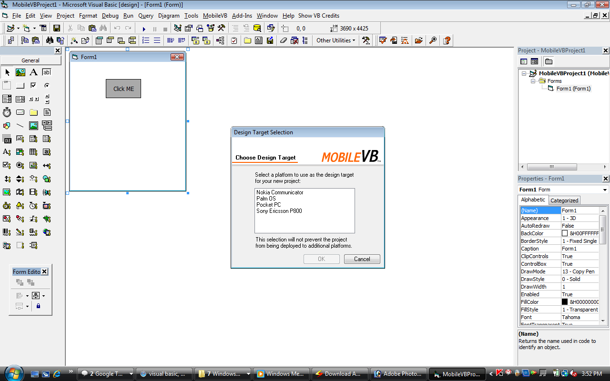



## Mobile VB

### Description

My article just acknowledge u that ur vb can be used to write mobile programs PocketPC,Symbian,PalmOS,UIQ etc.
 
### More Info
 

             |
---                |---
**Submitted On**   |
**By**             |[VishnuPrasad\.P](https://github.com/Planet-Source-Code/PSCIndex/blob/master/ByAuthor/vishnuprasad-p.md)
**Level**          |Advanced
**User Rating**    |3.7 (33 globes from 9 users)
**Compatibility**  |VB 3\.0, VB 4\.0 \(16\-bit\), VB 4\.0 \(32\-bit\), VB 5\.0, VB 6\.0
**Category**       |[Windows CE](https://github.com/Planet-Source-Code/PSCIndex/blob/master/ByCategory/windows-ce__1-41.md)
**World**          |[Visual Basic](https://github.com/Planet-Source-Code/PSCIndex/blob/master/ByWorld/visual-basic.md)
**Archive File**   |

### Source Code

HI everybody do u know that our vb6 can be used to write programs for mobile platforms like symbian,pocketpc,palmos etc.A third party tool have to be installed in our system to do this (appforge mobilevb after installing this vb IDE changes with some more controls and templates at startup an extra compile option to compile our program to mobile platform see the screenshots for more details download the appforge mobilevb and write programs to mobile platforms this is same as what we do in vb.

